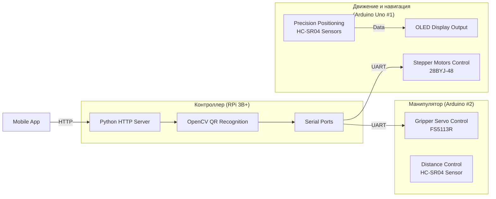

# Роботизированный сборщик заказов | Moscow Pre-Professional Olympiad 2023

[](https://www.arduino.cc/)
[](https://www.raspberrypi.org/)
[](https://opencv.org/)
[](https://python.org/)

> Аппаратно-программный комплекс для автоматической комплектации складских заказов. Система с компьютерным зрением, прецизионным позиционированием и распределенной архитектурой.

## Оглавление

- [Архитектура системы](#архитектура-системы)
- [Технологический стек](#технологический-стек)
- [Как это работает](#как-это-работает)
- [Ключевые задачи и решения](#ключевые-задачи-и-решения)
- [Демонстрация работы](#демонстрация-работы)
- [Документация и материалы](#документация-и-материалы)
- [Лицензия](#лицензия)

---

## Архитектура системы

Проект реализован по **распределенной архитектуре** с четким разделением ответственности между компонентами для обеспечения надежности и масштабируемости.



## Технологический стек

| Компонент                | Технологии / Модели | Назначение |
| ------------------------ | ------------------- | ---------- |
| **Ядро системы**         | Raspberry Pi 3B+, Python 3, OpenCV, HTTP.server | Распознавание QR-кодов, координация работы, API |
| **Движение и навигация** | Arduino Uno, C++, Stepper_28BYJ_48 lib, HC-SR04 | Позиционирование каретки                        |
| **Захват грузов**        | Arduino Uno, C++, Servo.h, FS5113R              | Управление механизмом захвата и отпускания      |
| **Связь и интерфейсы**   | UART (Serial), HTTP, кастомный ASCII-протокол   | Обмен данными между компонентами системы        |
| **Механика и корпус**    | 3D-печать (PLA), фанерные конструкции           | Несущая конструкция и функциональные элементы   |

## Как это работает

1.  **Формирование заказа:** Пользователь через мобильное приложение выбирает от 2 до 3 типов грузов (винты, гайки и т.д.) и запускает систему.
2.  **Координация:** Raspberry Pi получает заказ и запускает процесс, отправляя команды на Arduino по UART.
3.  **Навигация:** Каретка с манипулятором перемещается вдоль стеллажа с 9 ячейками. Точная остановка напротив каждой ячейки обеспечивается ультразвуковыми датчиками HC-SR04 и предрассчитанными координатами.
4.  **Распознавание:** Камера на каретке сканирует QR-код на грузе. Алгоритм на OpenCV декодирует его и определяет тип детали.
5.  **Захват и транспортировка:** Если груз входит в заказ, манипулятор захватывает его сервоприводом и перемещает в зону накопителя.
6.  **Комплектация:** Процесс повторяется до полного комплектования заказа. Система запоминает последнюю позицию для возобновления работы.

## Ключевые задачи и решения

| Проблема | Решение | Результат |
| -------- | ------- | --------- |
| **Точное позиционирование**       | Ультразвуковые датчики HC-SR04 + массив предрассчитанных координат (`penki[]`) | Точность остановки **±1 см** у каждой из 9 ячеек |
| **Синхронизация 3 устройств**     | Кастомный ASCII-протокол поверх UART (`'2'` - старт 2 груза, `'VINT'` - распознан винт) | Стабильная работа без потерь данных и коллизий |
| **Оптимизация нагрузки на CPU**   | Флаговый механизм ограничения частоты сканирования QR-кодов (`photo = 0/1`) | Снижение нагрузки на Raspberry Pi на **~40%** |
| **Низкоуровневое управление**     | Многозадачность через функцию `yield()` для параллельной работы моторов и логики | Плавное движение без блокирующих задержек |
| **Работа в условиях ограничений** | Оптимизация кода под 2КБ RAM Arduino, использование `String` вместо `char[]` | Стабильная работа на ограниченных ресурсах |

## Демонстрация работы

Система успешно прошла все испытания олимпиады, включая:
-   Комплектацию заказов из 2 и 3 грузов
-   Распознавание всех 9 типов грузов (винт, гайка, шайба, шпилька, подшипник, направляющая, вал, двигатель, датчик)
-   Сценарий с изменением состава заказа во время работы

> **Видео работы:** [Смотреть на YouTube](https://youtu.be/xSdcvUGpYvo)

## Документация и материалы

В репозитории представлена полная документация по проекту:
-   `Документация.pdf` — полное описание системы, схемы, UML-диаграммы
-   `Схемы/` — принципиальные и монтажные электрические схемы
-   `3D_модели/` — файлы для печати деталей корпуса и механизмов
-   `Исходный_код/` — программы для Raspberry Pi и Arduino

## 📄 Лицензия

Проект был разработан в образовательных целях для участия в Московской предпрофессиональной олимпиаде. Исходный код и документация публикуются в образовательных целях.

> **Примечание:** Это архивный проект, разработанный в 2023 году. Код и структура репозитория сохранены в оригинальном виде как свидетельство этапа обучения и развития инженерных навыков. Проект демонстрирует способность к созданию сложных распределенных систем и решению нетривиальных задач.
```
